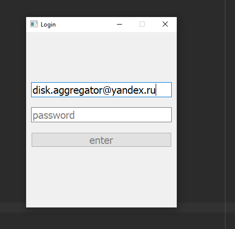
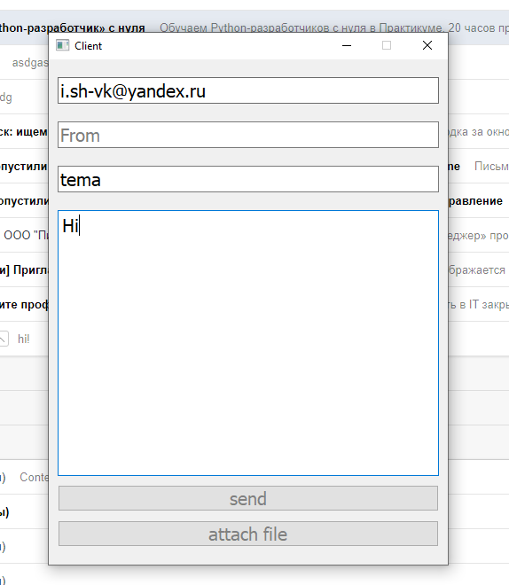
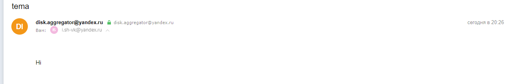

# Smtp
Smtp клинет с графическим интерфейсом.  
Для запуска необходимо установить необходимую библиотеку и запустить  
 `python -m pip install -r requirements.txt`,    
 `python main.py`
 
Авторизация  
 

Отправка сообщения  
 

И наше сообщение получено  
 

